# Agora Android Application

## Readme

Project to show my coding practices and UI Designs

_Android Application for Agora Web that uses [Agora](https://gitlab.com/aossie/Agora/): An Electronic Voting Library implemented in Scala. This application uses [Agora Web API](https://gitlab.com/aossie/Agora-Web) as backend application_

This project is created using [JavaSE](https://www.oracle.com/technetwork/java/javase/downloads/index.html) on [Android Studio](https://developer.android.com/studio).

To run the development environment for this frontend, you need [Git](https://git-scm.com/) installed.

## Design

[Figma Prototype](https://www.figma.com/proto/1Kha5Y7MgDUmhzmdO2U8g0/Agora-Android?node-id=225%3A125&viewport=172%2C24%2C0.43090125918388367&scaling=scale-down)

Note: Open link on laptop for smooth action.

<table>
   <tr>
     <td><kbd>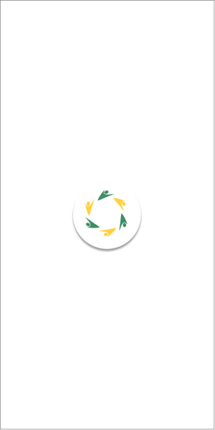</kbd></td>
     <td><kbd>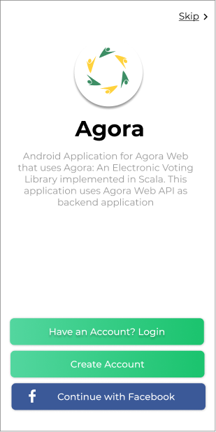</kbd></td>
     <tr> 
     <td><kbd>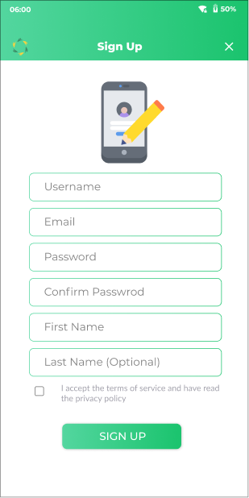</kbd></td>
     <td><kbd>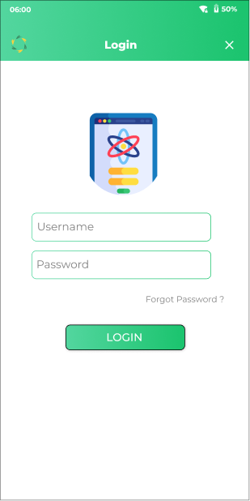</kbd></td>
    </tr>
    <tr>
     <td><kbd>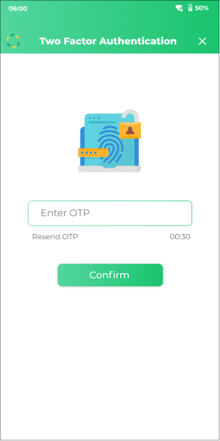</kbd></td>
     <td><kbd>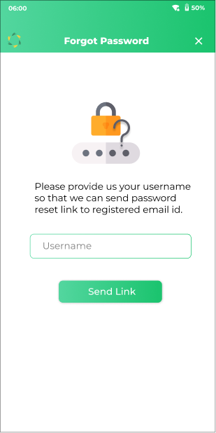</kbd></td>
     <tr> 
     <td><kbd>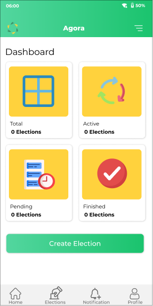</kbd></td>
     <td><kbd>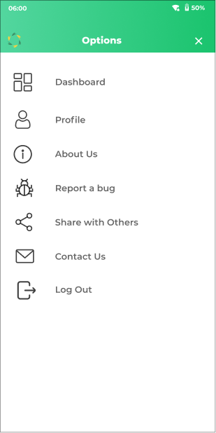</kbd></td>
    </tr>
   <tr>
     <td><kbd>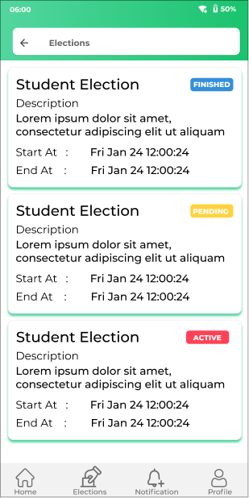</kbd></td>
     <td><kbd>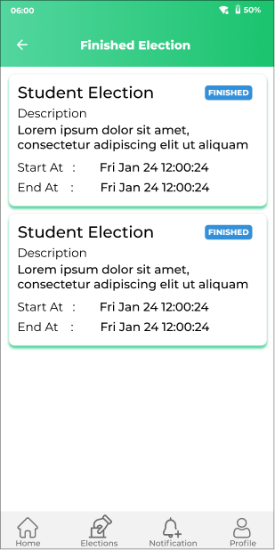</kbd></td>
    <tr> 
     <td><kbd></kbd></td>
     <td><kbd>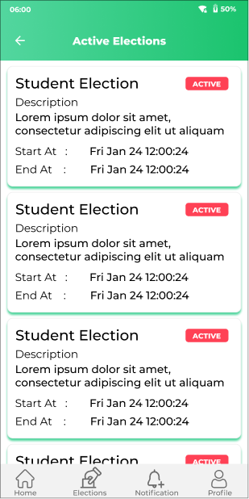</kbd></td>
    </tr>
    <tr>
     <td><kbd>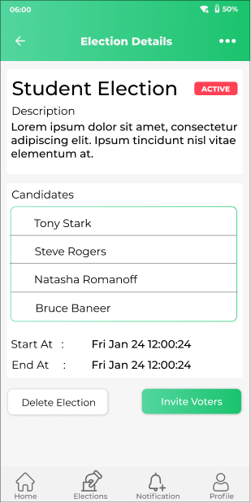</kbd></td>
     <td><kbd>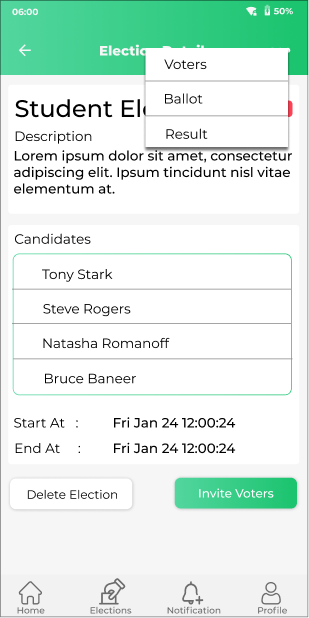</kbd></td>
     <tr> 
     <td><kbd>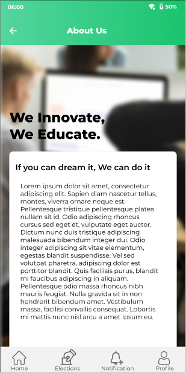</kbd></td>
     <td><kbd>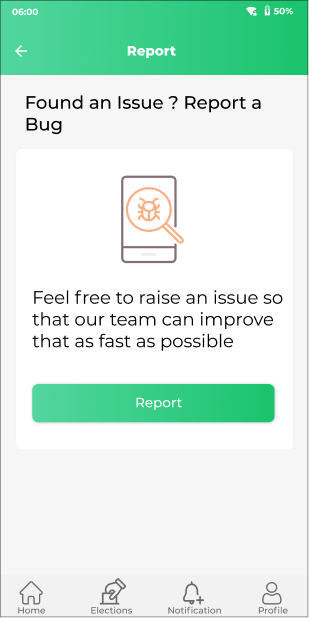</kbd></td>
    </tr>
    <tr>
     <td><kbd>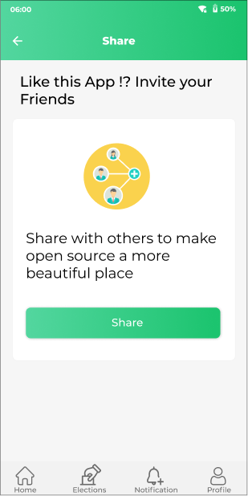</kbd></td>
     <td><kbd>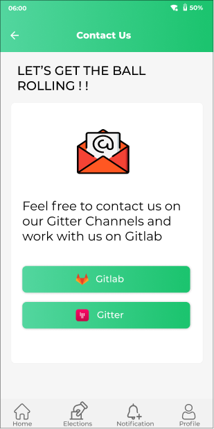</kbd></td>
     <tr> 
     <td><kbd>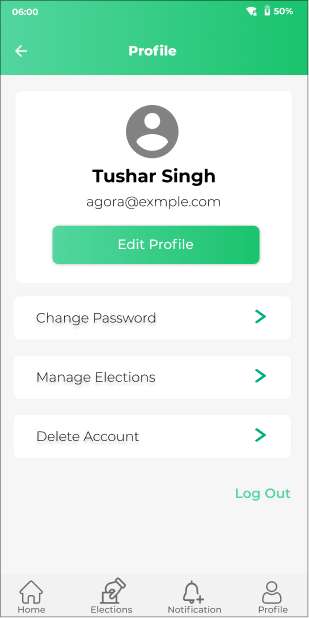</kbd></td>
     <td><kbd></kbd></td>
    </tr>
    <tr>
         <td><kbd>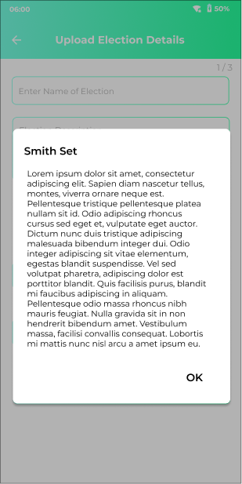</kbd></td>
         <td><kbd></kbd></td>
         <tr> 
         <td><kbd>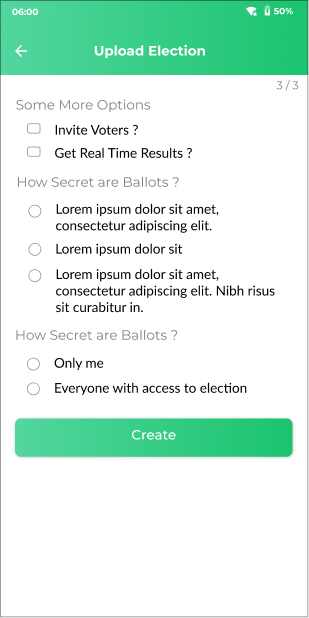</kbd></td>
     </tr>
    
</table>

